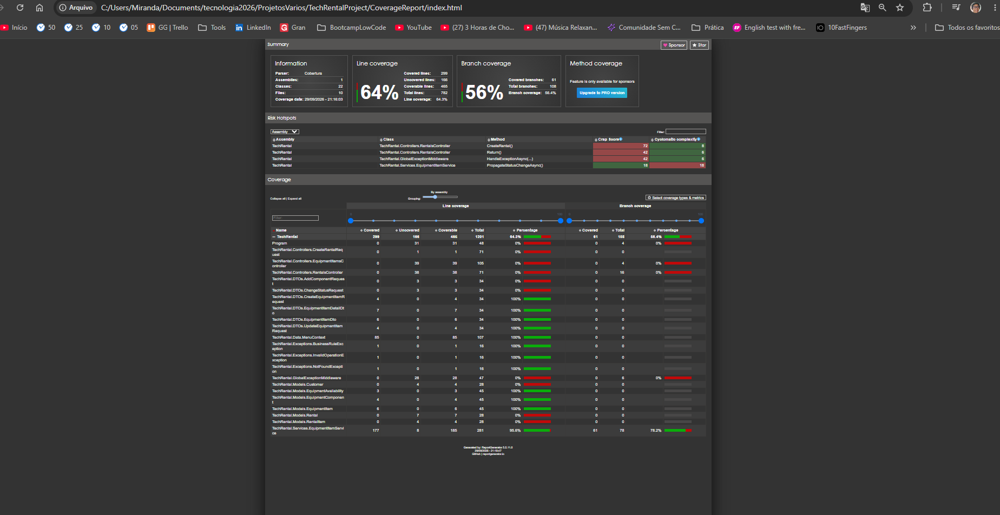

## 🧪 Testes automatizados e cobertura de código

O projeto **TechRental API** possui uma suíte de testes automatizados desenvolvida com **xUnit**, utilizada para validar regras de negócio, serviços, modelos e diferentes comportamentos da aplicação.

Atualmente, a suíte conta com:

- ✅ **24 testes automatizados**
- ✅ **24 testes aprovados**
- ❌ **0 testes com falha**
- 📊 **64,3% de cobertura de linhas**
- 🌿 **56,4% de cobertura de branches**
- 🧪 **299 de 465 linhas cobráveis executadas pelos testes**

A cobertura foi coletada utilizando **Coverlet** e analisada por meio do **ReportGenerator**, permitindo identificar visualmente quais classes, métodos e ramificações da aplicação são exercitados pela suíte de testes.

### 📊 Relatório de cobertura

O relatório atual apresenta **64,3% de Line Coverage** e **56,4% de Branch Coverage**.

> A cobertura não foi utilizada apenas como uma métrica numérica. O relatório também foi analisado para identificar pontos ainda não exercitados pelos testes e áreas com maior complexidade, servindo como referência para futuras evoluções da suíte.

### 🔎 Situação atual

Parte importante da camada de serviços e de diferentes componentes do domínio já possui cobertura elevada, incluindo classes que atingem **100% de cobertura**.

O relatório também evidencia pontos que ainda podem receber testes adicionais, principalmente controllers e componentes de tratamento de exceções. Essa diferença explica a existência de classes com cobertura total e outras ainda sem execução direta pela suíte.

A cobertura atual foi mantida de forma transparente como parte da documentação técnica do projeto, demonstrando tanto os cenários já validados quanto as oportunidades de evolução.

### 🛠️ Tecnologias utilizadas nos testes

- **xUnit** — framework de testes
- **FluentAssertions** — assertions mais legíveis
- **Entity Framework Core InMemory** — suporte aos cenários de teste que utilizam persistência
- **Coverlet** — coleta de cobertura
- **ReportGenerator** — geração do relatório HTML de cobertura

### 📷 Evidência

A imagem abaixo apresenta o relatório gerado durante a execução da suíte, incluindo cobertura de linhas, branches, classes analisadas e pontos de maior risco identificados pelo ReportGenerator e o relatório de cobertura dos testes automatizados:

